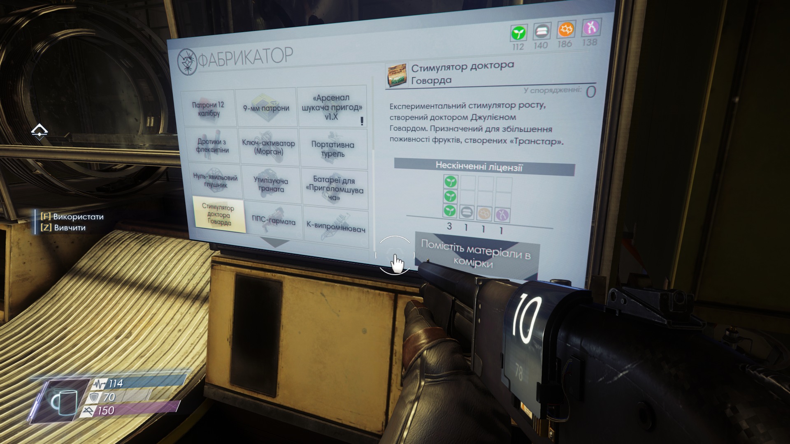

# Українська локалізація для Prey 2017

> Prey 2017 ukrainian localization

> **Проект на дуже ранній стадії розробки**

Репозиторій проекта з перекладу Prey 2017 українською. В планах поки є тільки переклад основної гри, без DLC

## Збірка, встановлення та видалення

Останній реліз можна знайти [тут](https://github.com/pepethelis/prey-ukrainian-localization/releases/latest)

Для коректного встановлення необхідно впевнитися, що створено файл локалізації саме для тієї мови, яка встановлена в грі. Якщо це не так то треба змінити мову гри на одну з доступних для встановлення перекладу або зібрати файл локалізації знову, для обраної мови

Встановлена мова гри впливає на мову, якою буде озвучка

### Для виконання збірки треба:

У результаті у вас повинен бути файл локалізації з назвою формата `*ваша мова озвучки*_xml_patch.pak`. Наприклад `English_xml_patch.pak`

#### Автоматична збірка для обраних мов:

1. Запустити файл `pack.bat`
2. Вибрати для якої мови озвучки треба створити збірку:
   1. 1 для англійської
   2. 2 для польскої
   3. 3 для німецької
   - Мова за замовчуванням - англійська
3. Перейти до файлу збірки у теці `./build`

ВАЖЛИВО: від вибору варіанту при створенні збірки зміст локалізацї не змінюється. Тобто це лише швидкий спосіб створити збірки для обраних мов

#### Ручна збірка локалізації:

1. Запакувати файли теки src у zip архів
   - Важливо: пакувати треба саме файли з теки, а не всю теку. Також треба пакувати саме у zip
2. Змінити розширення новогу архіву з .zip на .pak
3. Змінити назву файлу відповідно мови гри:
   1. `English_xml_patch` для англійської
   2. `polish_xml_patch` для польскої
   3. `German_xml_patch` для німецької

### Встановлення

1. Перейдіть у теку встановлення гри
2. Пререйдіть у теку Localization
3. Замініть старий файл локалізації новим. За бажанням можна зберігти старий файл, змініивши йому назву, наприклад додавши .old в кінці назви файла

### Видалення

Замініть файл локалізації файлом бекапа, створеним під час встановлення.

Якщо ви забули створити резервну копію, ви також можете просто повторно перевірити цілісність файлів гри.

## Сумісніть

Локалізація не буде сумісною з модами, які також замінюють файли локалізації. В іншому випадку він повинен добре працювати з більшістю інших модів.

## Посилання та цікавинки

- Щира подяка автору [статті](https://rosodudemods.wordpress.com/prey-modding-guide/) щодо модифікації гри

- Щира подяка автору [статті](https://ukrainizer.netlify.app/) щодо створення українізаторів. Нажаль, коли її знайшов вже сам у всьому розібрався, тому не повторюйте моїх помилок і не губіть статтю

- [Мод](https://www.nexusmods.com/prey2017/mods/70) із навмисно заплутаною англійською методом багатократного перекладу на кілька мов

---

